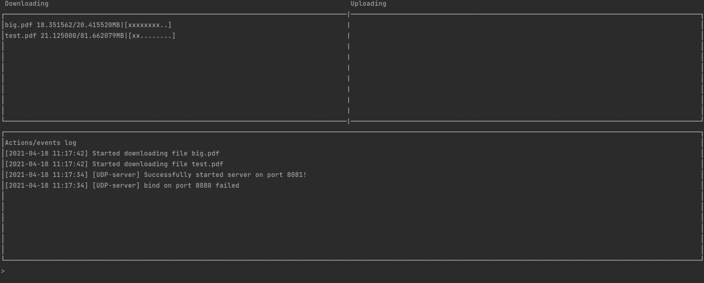
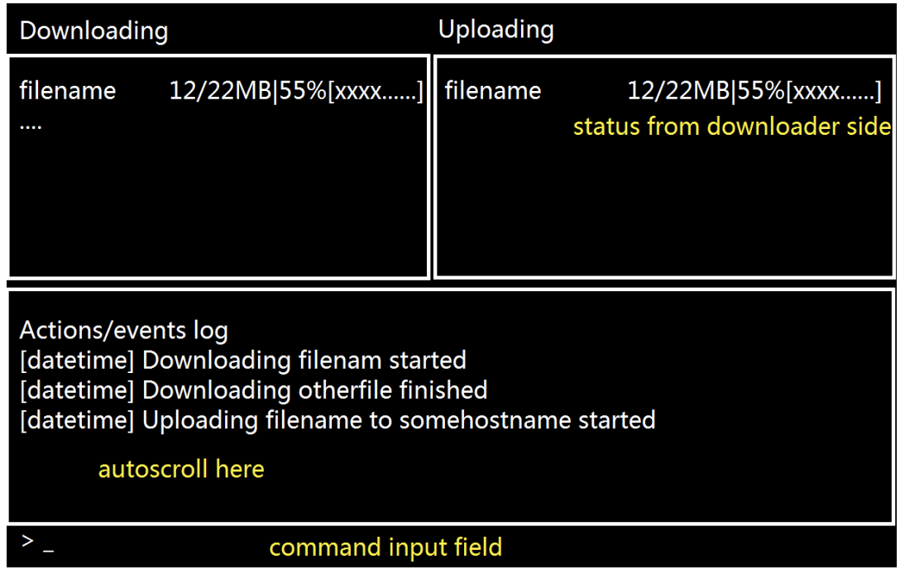

# File exchange

One combined mode of operation. At startup, the command line argument specifies
the path to the directory for operation (maintenance). At the time of startup, the server recursively scans
the specified directory and calculates hashes for all files. The program will allow downloading these files
to other instances connecting to it. In parallel, incoming connections are being received and commands are being entered from the console.

The screen interactively displays a list of downloaded and given files with progress
in percentages and bytes, the command input area. Three commands are processed:
1. Output of the "file name – size - hash" triplet for the relative path of the file from the working
directory.
2. Enter the "file name - size - hash" triplet for download.
3. Completion of the program

When you enter a download command using a UDP broadcast, other instances of the program are detected on the network, and a response packet from them receives a port for TCP connection. After the connection is established, the file is requested via a triplet,
and if it is detected, the download begins. Provide simultaneous downloading of different fragments of the same desired file from multiple sources

# DEMO UI & DESIGN UI

